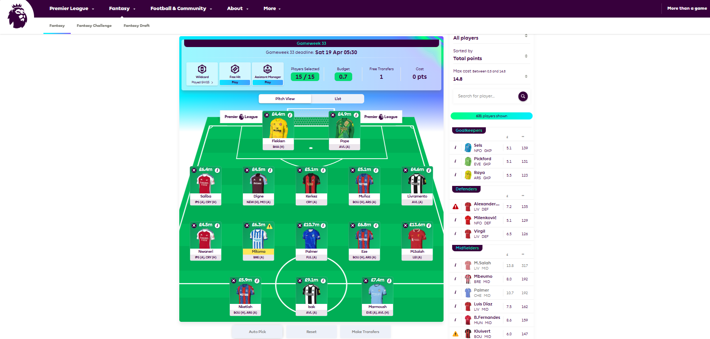
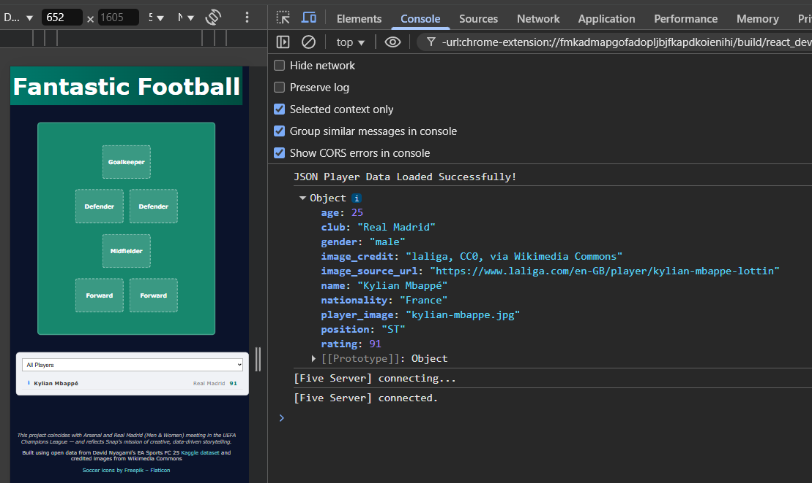
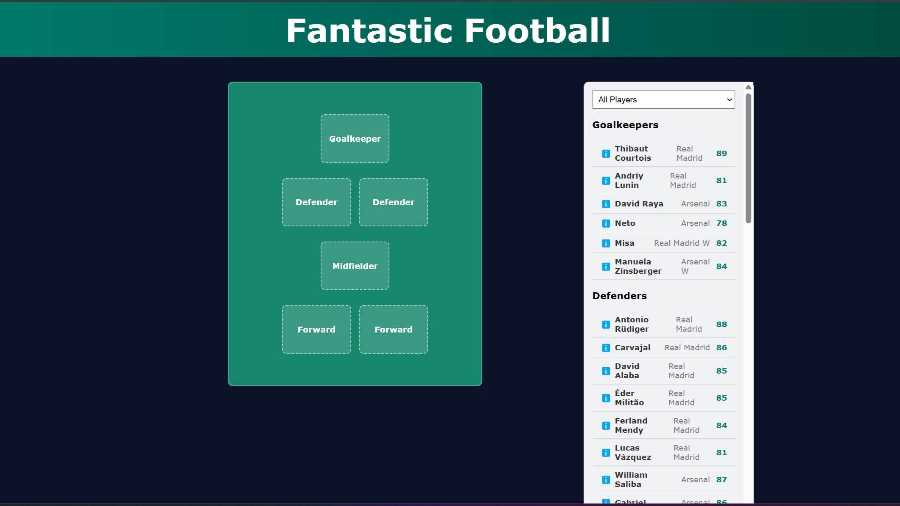
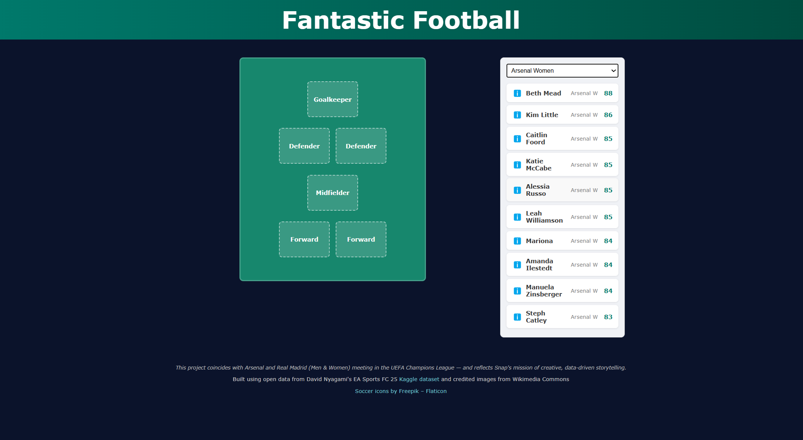
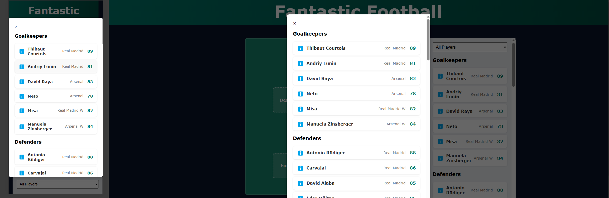

# ⚽️ Co-Ed Fantasy Football Selector

This is my personal submission for the **Snap Engineering Academy Stage 2 - Data Catalog Project**, themed around real-world football matchups and inspired by Premier League Fantasy UI design.

The project uses structured player data, HTML/CSS for design, and **vanilla JavaScript** for all interactivity — in full accordance with SEA guidelines.

---

## 🏁 Project Setup Steps

### ✅ Meta Tag for Responsiveness
```html
<meta name="viewport" content="width=device-width, initial-scale=1.0">
```

### ✅ Step 1: Repository Creation
- GitHub Repo: [rabogan/coed-fantasy-football](https://github.com/rabogan/coed-fantasy-football)
- Created from the SEA Stage 2 template using the "Use this template" button.

### ✅ Step 2: Local Environment
```bash
git clone https://github.com/rabogan/coed-fantasy-football.git
cd coed-fantasy-football
```

### ✅ Step 3: First Browser Test
- Opened in VS Code → launched `index.html` in browser → verified starter layout.

### ✅ Step 4: Deployment
- Live via GitHub Pages:
  [https://rabogan.github.io/coed-fantasy-football](https://rabogan.github.io/coed-fantasy-football)

---

## 🎨 Theme: Co-Ed Dream Team – Fantasy Football Selector

- Based on **Real Madrid** and **Arsenal** (Men & Women).
- Coincides with actual UEFA Champions League fixtures.
- Co-ed twist + fantasy football styling.
- Displays a virtual pitch and sortable, filterable player list.



---

## 🗂️ Data & Assets

### 📦 `player_dataset.json` Structure
An array of **objects**, each with:
```json
{
  "name": "Kylian Mbappé",
  "rating": 91,
  "position": "ST",
  "club": "Real Madrid",
  "gender": "Male",
  ...
}
```

### 🖼 Image Sources
- Player images: Wikimedia Commons (`/player-images/`)
- Citations listed in `images/credits.txt`

### 🔗 External Resources
- [EA Sports FC 25 Ratings Dataset (Kaggle)](https://www.kaggle.com/datasets/nyagami/ea-sports-fc-25-database-ratings-and-stats?resource=download)
- [Soccer icons by Freepik - Flaticon](https://www.flaticon.com/free-icons/soccer)

---

## 📎 Footer Snippet
```html
<footer>
  <p>Built using open data from David Nyagami's EA Sports FC 25 <a href="https://www.kaggle.com/datasets/nyagami/ea-sports-fc-25-database-ratings-and-stats?resource=download">Kaggle dataset</a> and credited images from Wikimedia Commons</p>
  <p><a href="https://www.flaticon.com/free-icons/soccer" target="_blank" rel="noopener noreferrer">Soccer icons by Freepik – Flaticon</a></p>
  <p class="footer-author-message">This project coincides with Arsenal and Real Madrid (Men & Women) meeting in the UEFA Champions League — and reflects Snap's mission of creative, data-driven storytelling.</p>
</footer>
```

---

## 📱 Mobile Responsiveness
All styles adjusted with media queries:
```css
@media (max-width: 768px) {
  .main-container {
    flex-direction: column;
  }
  .pitch-panel {
    order: -1;
  }
}
```
- Pitch shown above the list on small screens.
- Panel height, font size, and spacing adjusted for usability.

---

## 🧩 Feature Roadmap (MVP)

- [x] Custom pitch UI (2-1-2 layout)
- [x] JSON-based card rendering
- [x] Modal placeholder for player detail
- [x] Player filtering: team / gender / position
- [ ] Select up to 6 players (in progress)
- [ ] Save or export functionality

---

## 🌟 Future Enhancements
- Add custom formations (drag + drop?)
- Include local team upload form
- Dark mode toggle
- Save team state as image or JSON
- Improve desktop spacing/layout

---

## 📸 Milestone Progress

### ✅ Milestone 1: Initial Layout


### ✅ Milestone 2: JSON Object + Mobile View


### ✅ Milestone 3: Grouped Rendering by Position


### ✅ Milestone 4: Working Dropdown + Filtering

- Built dropdown UI with HTML `<optgroup>` (ref: [MDN](https://developer.mozilla.org/en-US/docs/Web/HTML/Element/optgroup))
- Used [W3Schools dropdown template](https://www.w3schools.com/howto/tryit.asp?filename=tryhow_css_js_dropdown) for ideas
- Implemented `change` event listener ([MDN reference](https://developer.mozilla.org/en-US/docs/Web/API/HTMLElement/change_event))
- Used object mappings in code like:
- Referenced helpful documentation:
  - [W3Schools Dropdown Menu Tutorial](https://www.w3schools.com/howto/tryit.asp?filename=tryhow_css_js_dropdown)
  - [MDN switch statement](https://developer.mozilla.org/en-US/docs/Web/JavaScript/Reference/Statements/switch)
```js
export const positionGroups = { ... };
export const clubMapping = { ... };
export const genderMapping = { ... };
export const positionGroupMapping = { ... };
```
> ⚠️ I've used this modular style with React before, but wasn't sure if it’s standard for vanilla JavaScript. Keeping logic grouped in one file felt cleaner for this project.

### Milestone 5: Modal Popup for Player Selection

- Successfully implemented a modal popup triggered by clicking on any pitch position.
- The modal displays a larger, centralized version of the player list for easier browsing.
- Each pitch slot listens for both `click` and `touchstart` events for device flexibility.
- Modal closes via the "×" button (with plans to support click-outside-to-close soon).
- Code improvements:
  - Removed redundant CSS.
  - Ensured modal content is dynamically populated from the live player list.
- See section on Modals below!

---

## 🧱 Player Card & Interaction

- `ℹ️` info button on left side (modal coming soon)
- Simple structure:
  `info-icon` → `name` → `club` → **EA Rating**
- Grouped visually by position
- Dynamic rendering with:
  ```js
  import { buildPlayerEntry } from './helpers/buildPlayerEntry.js';
  ```

---

## 🧪 Manual Testing Notes

- All 60 players load correctly
- Cards look great on mobile
- Desktop spacing improved, but not final
- JSON loading and filtering debugged via `console.log()`

---

## 📓 Personal Notes

- Still learning best practices for organizing JS files in vanilla environments
- I may revise to make the dropdown behavior more DRY (less repetition)
- README updated often — final design not yet complete!

---

## 🧰 Refresher of Modals and Popups using W3Schools Logic

Inspired by the W3Schools approach to modal design, the player list popup on smaller devices uses a reusable modal structure with click/touch support. It overlays cleanly and supports responsive display and dismissal.

### 📦 HTML Markup (Player List Modal)
```html
<div id="playerListModalPopup" class="modal hidden">
  <div class="modal-content">
    <span id="closePlayerListModal">&times;</span>
    <div id="playerListPopupContent" class="scrollable-player-list"></div>
  </div>
</div>
```

### 🎨 CSS Styling (modal + mobile responsiveness)
```css
.modal {
  position: fixed;
  top: 0;
  left: 0;
  width: 100%;
  height: 100%;
  background-color: rgba(0,0,0,0.6);
  display: flex;
  align-items: center;
  justify-content: center;
  z-index: 10;
  opacity: 1;
  transition: opacity 0.3s ease;
}

.modal.hidden {
  display: none;
  opacity: 0;
  pointer-events: none;
}

.modal-content {
  background: #fff;
  padding: 1.5rem;
  border-radius: 10px;
  width: 90%;
  max-width: 500px;
  max-height: 80vh;
  overflow-y: auto;
  position: relative;
  box-shadow: 0 4px 15px rgba(0, 0, 0, 0.2);
}

/* Responsive tweaks */
@media (max-width: 768px) {
  .modal-content {
    width: 95%;
    height: 90vh;
  }
}
```

### 🧠 JavaScript Logic
```js
// Show modal when a pitch position is clicked or touched
document.querySelectorAll('.position-slot').forEach(slot => {
  slot.addEventListener('click', () => {
    const popup = document.getElementById('playerListModalPopup');
    const content = document.getElementById('playerListPopupContent');
    content.innerHTML = document.getElementById('playerList').innerHTML;
    popup.classList.remove('hidden');
    console.log('📣 Modal opened via click');
  });

  slot.addEventListener('touchstart', () => {
    const popup = document.getElementById('playerListModalPopup');
    const content = document.getElementById('playerListPopupContent');
    content.innerHTML = document.getElementById('playerList').innerHTML;
    popup.classList.remove('hidden');
    console.log('📱 Modal opened via touch');
  });
});

// Close modal with X button
document.getElementById('closePlayerListModal').addEventListener('click', () => {
  document.getElementById('playerListModalPopup').classList.add('hidden');
  console.log('❌ Modal closed manually');
});

// Close modal by clicking outside the popup content
document.getElementById('playerListModalPopup').addEventListener('click', (e) => {
  const modalContent = document.querySelector('#playerListModalPopup .modal-content');
  if (!modalContent.contains(e.target)) {
    document.getElementById('playerListModalPopup').classList.add('hidden');
    console.log('🖱️ Modal closed by clicking outside');
  }
});
```

> ℹ️ Inspired by [W3Schools Modal Examples](https://www.w3schools.com/howto/howto_css_modals.asp), this implementation ensures proper mobile handling and responsiveness without requiring multiple modal components.

---

## 📄 License

See the [LICENSE](LICENSE) file.
