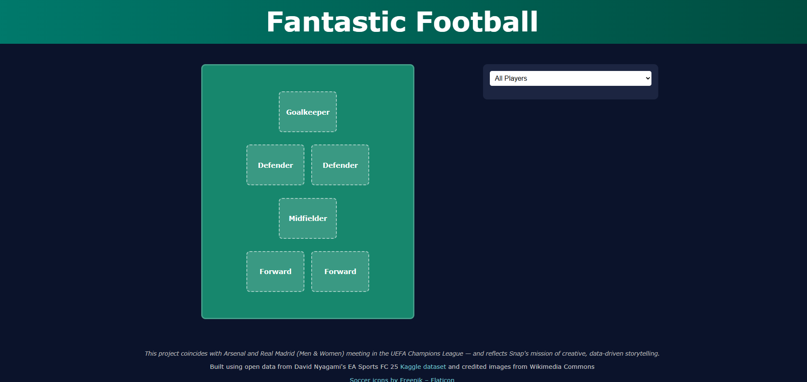

# ⚽️ Co-Ed Fantasy Football Selector

This is my personal submission for the **Snap Engineering Academy Stage 2 - Data Catalog Project**, themed around real-world football matchups and inspired by Premier League Fantasy UI design.

The project uses structured player data, HTML/CSS for design, and **vanilla JavaScript** for all interactivity — in full accordance with SEA guidelines.

---

## 🏁 Project Setup Steps

### ✅ Meta Tag for Responsiveness
- Included the following tag in `index.html` for proper mobile scaling:
```html
<meta name="viewport" content="width=device-width, initial-scale=1.0">
```

### ✅ Step 1: Repository Creation
- GitHub Repo: [rabogan/coed-fantasy-football](https://github.com/rabogan/coed-fantasy-football)
- Created from the SEA Stage 2 template using the "Use this template" button.

### ✅ Step 2: Local Environment
```bash
# Clone locally and enter the folder
git clone https://github.com/rabogan/coed-fantasy-football.git
cd coed-fantasy-football
```

### ✅ Step 3: First Browser Test
- Opened the folder in VS Code.
- Launched `index.html` in the browser.
- Confirmed initial rendering and layout from starter files.

### ✅ Step 4: Deployment
- Deployed live using **GitHub Pages**.
- 🔗 Live Site: [https://rabogan.github.io/coed-fantasy-football](https://rabogan.github.io/coed-fantasy-football)

---

## 🎨 Theme: Co-Ed Dream Team – Fantasy Football Selector

- Based on **Real Madrid** and **Arsenal** (Men & Women squads).
- Launching during a week when the real-life teams (men and women) are playing each other in the **UEFA Champions League**.
- Inspired by fantasy football games, with a 6-a-side **co-ed twist**.
- Layout includes a visual football pitch and sortable player catalog.


---

## 🗂️ Data & Assets

### 📦 Data Structure
Player data lives in `player_dataset.json`, structured as an array of **objects**. Each player includes:
- `name`, `rating`, `position`, `age`, `club`, `nationality`, `gender`, `player_image`, and `image_credit`

### 🖼 Images
- Player images from **Wikimedia Commons**, saved to `player-images/`
- Citations and licenses listed in `images/credits.txt`

### 🔗 Sources
- **Favicon** from: [Soccer icons created by Freepik - Flaticon](https://www.flaticon.com/free-icons/soccer)
- **Dataset**: [EA Sports FC 25: Ratings and Stats](https://www.kaggle.com/datasets/nyagami/ea-sports-fc-25-database-ratings-and-stats?resource=download)
  - Top 20 male and top 10 female players from each club.
  - Gender labels and image references were added manually.

### 📎 Footer Credit
```html
<footer>
  <p>Built using open data from David Nyagami's EA Sports FC 25 <a href="https://www.kaggle.com/datasets/nyagami/ea-sports-fc-25-database-ratings-and-stats?resource=download">Kaggle dataset</a> and credited images from Wikimedia Commons</p>
  <p><a href="https://www.flaticon.com/free-icons/soccer" target="_blank" rel="noopener noreferrer">Soccer icons by Freepik – Flaticon</a></p>
  <p class="footer-author-message">This project coincides with Arsenal and Real Madrid (Men & Women) meeting in the UEFA Champions League — and reflects Snap's mission of creative, data-driven storytelling.</p>
</footer>
```

---

## 📱 Mobile Responsiveness Improvements

To enhance the user experience on smaller screens, the layout now gracefully adapts for mobile:

- On screens ≤ 768px, the layout switches from a side-by-side view to a stacked layout using Flexbox.
- The pitch now appears **above** the player list on mobile for better usability and visual flow.
- On screens ≤ 500px, additional refinements were added:
  - Reduced pitch height to prevent vertical overflow.
  - Shrunk player slot sizes and font for better fit.
  - Header font size scaled down to avoid crowding.
  - Filters/dropdowns are more compact and tap-friendly.
  - Extra spacing was added below the player panel for comfortable scrolling.

All changes are implemented with clean, scoped media queries — without affecting desktop layouts.

```css
/* Example: Mobile stacking behavior */
@media (max-width: 768px) {
  .main-container {
    flex-direction: column;
  }

  .pitch-panel {
    order: -1;
  }
}
```

---

## 🧩 Feature Roadmap (MVP Goals)

1. **HTML/CSS Layout**
   - Custom formation layout (2-1-2) over a football pitch.
   - Sidebar for the player list (filterable/sortable).

2. **Rendering**
   - Display player cards using `player_dataset.json`.
   - Implement modal-style detail view.

3. **Filtering & Sorting**
   - Filter players by club, gender, and position.
   - Sort by rating or alphabetical order.

4. **Player Selection Logic**
   - Select up to 6 players.
   - Cards color-coded by club.

---

## 🌟 Future Enhancements

- **Form Uploads for Local Clubs** (expansion idea)
- **Change Formations**
- **Drag-and-Drop Positioning**
- **Expanded Dataset with More Teams & Legends**
- **Dark Mode and Alternate Formations**
- **Save & Share Team (as JSON/image)**

---

## 📸 Milestone Progress

### Milestone 1: Initial Layout Complete

- Pitch view, club dropdown, and CSS theme are now in place.
- Structural transformation from LA TV Shows template to football-centric UI.

- Responsive design adjustments for mobile devices.
- Using JS to load the first object in the player dataset.json.
- Confirmed JSON array uses objects with key attributes for display.
---

## 📄 License
See the [LICENSE](LICENSE) file for licensing details.

---

## 🧱 Player Card Layout & Interaction

- Players are listed below the dropdown menu, initially grouped by position.
- Each player is rendered from `player_dataset.json` with fields like `name`, `club`, `position`, and **EA Rating** (from the `rating` key).
- The left side of each card includes an **information button** (`i`) to open a modal.
- Modals differ slightly by device:
  - On **desktop**, the modal appears centered over the page.
  - On **mobile**, it opens full-width or over the player list.
- Team color is indicated by a **simple circular badge**: red for Arsenal, white for Real Madrid.

---

## 🧪 Manual Testing Progress

- Manually created a first player card for **Kylian Mbappé** under the `#playerList` container in `index.html`.
- Adjusted layout and CSS to match a simple structure: Info Button → Name → Club → **EA Rating** (e.g., `91`).
- Removed gender and club dot icons for a cleaner look.
- Confirmed JSON loads via `fetch('player_dataset.json')`, logging Mbappé as expected.
- Modal will be implemented later, but structure and styling are being prepped.

---

## 📓 Personal Notes
This README is updated regularly to track decisions, progress, and ideas.

