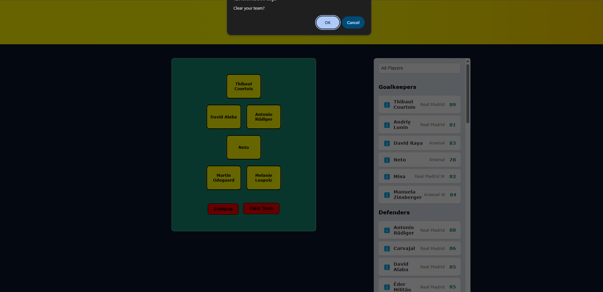

# ⚽️ Co-Ed Fantasy Football Selector

A dynamic, mobile-responsive, fantasy football team builder — showcasing simple use of real-world data structures and objects, logic, and interactive UI design.
Created for the **Snap Engineering Academy Stage 2: Data Catalog Project**.

🔗 **Live Site:** [rabogan.github.io/coed-fantasy-football](https://rabogan.github.io/coed-fantasy-football)  
📁 **Repo:** [github.com/rabogan/coed-fantasy-football](https://github.com/rabogan/coed-fantasy-football)

> 💬 **Note on AI Usage:**  
> No generative AI was used to write JavaScript logic or generate player data.  
> HTML and CSS were styled with the help of ChatGPT and GitHub Copilot, in accordance with SEA guidelines.

---

## 📚 Table of Contents

- [Project Setup Steps](#-project-setup-steps)
- [Theme & Design](#-theme-co-ed-6-a-side-dream-team)
- [Data & Assets](#-data--assets)
- [Milestone Progress](#-milestone-progress)
- [MVP Features](#-mvp-features-complete)
- [Feature Roadmap](#-feature-roadmap-mvp)
- [Future Enhancements](#-future-enhancements)
- [Technical Highlights](#-skills-demonstrated)
- [Code Quality & Modal Design](#-refresher-of-modals-and-popups-using-w3schools-logic)
- [Manual Testing Notes](#-manual-testing-notes)
- [Personal Notes](#-personal-notes)
- [Appendix](#-appendix)
- [License](#-license)
---

## 🏁 Project Setup Steps

### ✅ Step 1: Repository Creation
- Created from the SEA Stage 2 template using the "Use this template" button.

### ✅ Step 2: Local Environment
```bash
git clone https://github.com/rabogan/coed-fantasy-football.git
cd coed-fantasy-football
```

### ✅ Step 3: First Browser Test
- Opened in VS Code → launched `index.html` in browser → verified starter layout.

### ✅ Step 4: Deployment via GitHub Pages
[https://rabogan.github.io/coed-fantasy-football](https://rabogan.github.io/coed-fantasy-football)

### ✅ Step 5: Mobile Responsiveness
Added viewport tag for responsive scaling:

```html
<meta name="viewport" content="width=device-width, initial-scale=1.0">
```

---

## 🎨 Theme: Co-Ed 6-a-side Dream Team

This week saw **Real Madrid** face **Arsenal** (Men & Women) in the Champions League. Inspired by this, and my own co-ed rec league in Long Beach, I created a fantasy-style team selector to build mixed-gender dream squads.

Features:

- Select up to 6 players
- Filter by gender, club, and position
- Evaluate your team’s average EA rating
- Mobile-friendly layout and modal interfaces


---

## 🗂️ Data & Assets

### 📦 Dataset Structure (`player_dataset.json`)
An array of player objects derived from a Kaggle dataset. There was mild manipulation of the original dataset to remove unwanted columns and add the image source and credit. After downloading photos of each player from Wikimedia Common, added an image source and credit to each player entry in my spreadsheet manually. I then exported my data as a CSV, using the website [https://www.convertcsv.com/csv-to-json.htm](https://www.convertcsv.com/csv-to-json.htm). Here is the first entry in the JSON dataset:

```json
{
    "name":"Kylian Mbapp\u00e9",
    "position":"ST",
    "rating":91,
    "nationality":"France",
    "club":"Real Madrid",
    "gender":"male",
    "age":25,
    "player_image":"kylian-mbappe.jpg",
    "image_source_url":"https:\/\/www.laliga.com\/en-GB\/player\/kylian-mbappe-lottin",
    "image_credit":"laliga, CC0, via Wikimedia Commons"
}
```

### 📸 Image Sources

- Player images: Wikimedia Commons (`/player-images/`)
- Image attributions listed in `images/credits.txt`

### 🔗 External Resources

- [EA Sports FC 25 Ratings Dataset (Kaggle)](https://www.kaggle.com/datasets/nyagami/ea-sports-fc-25-database-ratings-and-stats?resource=download)
- [Soccer icons by Freepik – Flaticon](https://www.flaticon.com/free-icons/soccer)

---

## ✅ MVP Features (Complete)

- [x] Filter and sort players by club, position, and gender
- [x] Select up to 6 players on a co-ed team
- [x] Visual pitch UI with dynamic updates
- [x] Prevent duplicate selections using a `Set`
- [x] Modal for mobile-friendly player selection
- [x] Modal for detailed player profiles
- [x] Team score evaluation (average EA rating)
- [x] Clear/reset team functionality
- [x] Fully responsive across devices

---

## 🧩 Feature Roadmap (MVP)

- [x] Custom pitch UI (2-1-2 layout)
- [x] JSON-based card rendering
- [x] Modal placeholder for player detail
- [x] Player filtering: team / gender / position
- [x] Select up to 6 players
- [x] Team score calculator
- [x] Team reset button
- [x] Responsive design

---

## 🌟 Future Enhancements

- Add more team and player information filtering by league
- Remove bug on information button on player profile modal
- Remove hardcoding of teams in the HTML file and build dynamically
- Much better error handling required when loading from JSON dataset
- Alternative formations (2-2-1, 3-1-1, 1-2-2)
- Use of club logos to identify teams
- Drag-and-drop functionality
- Local squad and individual player uploads (JSON file)
- Save team state as image or JSON to share via social media
- Dark mode toggle

---

## 📸 Milestone Progress

Each feature was developed iteratively with testing and screenshots:
- Initial layout → JSON rendering → modal integration → filtering logic → interactivity polish  
### ✅ Milestone 1: Initial Layout


### ✅ Milestone 2: JSON Object + Mobile View


### ✅ Milestone 3: Grouped Rendering by Position


### ✅ Milestone 4: Working Dropdown + Filtering


### ✅ Milestone 5: Modal Popup for Player Selection


### ✅ Milestone 6: Add Player to Pitch


### ✅ Milestone 7: Allow Deletion of Players from Set


### ✅ Milestone 8: Clear Team Button Added


### ✅ Milestone 9: Evaluate Team Score Added


### ✅ Milestone 10: Player Information Modal (Profile Viewer)


### ✅ Milestone 11: Final UI Polish & Mobile Optimization


---

## 🛠️ Skills Demonstrated

- **HTML/CSS**: Layout, styling, mobile-first media queries
- **JavaScript**:
  - Arrays, Objects, Sets
  - `.forEach()`, `.find()`, `.reduce()`
  - `Set.add()`, `.has()`, `.delete()`
- DOM manipulation & event listeners
- Modal logic using native JS
- Responsive layout design
- GitHub Pages deployment
- Defensive coding (prevent ghost clicks)

---

## 🧰 Refresher of Modals and Popups Using W3Schools Logic

Mobile-first modals were inspired by:
- [W3Schools Modal Tutorial](https://www.w3schools.com/howto/howto_css_modals.asp)

Modal logic includes:

- Click/touch handling
- Dynamic inner HTML
- Close via X or outside click
- Touch event `preventDefault()` to block ghost clicks

```js
element.addEventListener('touchstart', (e) => {
  e.preventDefault(); // Prevent ghost click
  openModal();
}, { passive: false });
```

---

## 🧪 Manual Testing Notes

- All 60 players render correctly
- Mobile modal performs well
- Filtering accurate across categories
- Pitch selections update as expected
- Known bug fixed: duplicate blocking via `Set`

---

## 📓 Personal Notes

- Returning to coding after a break — this project re-ignited my love for JS!
- Learned new ES6+ methods and improved code organization
- Found joy in clean UI and responsive design challenges
- README updated often throughout the build process

### 🙌 Thank You

This project was a blast to build and reflects the kind of creative, structured problem-solving that drew me to engineering in the first place. Thanks to the Snap Engineering Academy team for creating such a thoughtful and empowering challenge. I'm looking forward to returning to this project after the process is completed.

---

## 📄 Appendix

This appendix includes additional references, file breakdowns, code explanations, and licensing for assets used.

### 📁 File Structure Overview

- `index.html` – main HTML structure
- `style.css` – base styles and media queries
- `scripts.js` – all logic, interactivity, and filtering
- `player_dataset.json` – custom player data from EA dataset, enhanced with images and credits
- `images/` – screenshots and player images
- `helpers/` – utility functions (e.g. buildPlayerEntry.js)

### ✅ Milestone 4 Explained: Working Dropdown + Filtering

- Built dropdown UI with HTML `<optgroup>` (ref: [MDN](https://developer.mozilla.org/en-US/docs/Web/HTML/Element/optgroup))
- Used [W3Schools dropdown template](https://www.w3schools.com/howto/tryit.asp?filename=tryhow_css_js_dropdown) for ideas
- Implemented `change` event listener ([MDN reference](https://developer.mozilla.org/en-US/docs/Web/API/HTMLElement/change_event))
- Used object mappings in code like:
- Referenced helpful documentation:
  - [W3Schools Dropdown Menu Tutorial](https://www.w3schools.com/howto/tryit.asp?filename=tryhow_css_js_dropdown)
  - [MDN switch statement](https://developer.mozilla.org/en-US/docs/Web/JavaScript/Reference/Statements/switch)
```js
export const positionGroups = { ... };
export const clubMapping = { ... };
export const genderMapping = { ... };
export const positionGroupMapping = { ... };
```
> ⚠️ I've used this modular style with React before, but wasn't sure if it’s standard for vanilla JavaScript. Keeping logic grouped in one file felt cleaner for this project.

### Milestone 5 Explained: Modal Popup for Player Selection

- Successfully implemented a modal popup triggered by clicking on any pitch position.
- The modal displays a larger, centralized version of the player list for easier browsing.
- Each pitch slot listens for both `click` and `touchstart` events for device flexibility.
- Modal closes via the "×" button (with plans to support click-outside-to-close soon).
- Code improvements:
  - Removed redundant CSS.
  - Ensured modal content is dynamically populated from the live player list.
- See section on Modals below!

### ✅ Milestone  Explained: Add Player to Pitch

- Players can now be selected and placed onto the pitch in any position.
- Once selected, a player's name appears on the chosen slot with neutral styling (light background, dark font).
- A global `Set` (`selectedPlayerSet`) tracks unique players and prevents duplicates.
- Selections are responsive across web and mobile.

---

### ✅ Milestone 7 Explained: Allow Deletion of Players from Set

- Clicking a player already placed on the pitch now triggers a **confirmation alert** using `window.confirm()`.
- If confirmed, the player is removed from the global `Set` (`selectedPlayerSet`), allowing them to be selected again.
- The pitch slot is also reset to its original role name (e.g., "Midfielder"), mimicking its initial appearance.
- This allows for full team editing using only native JavaScript.

### 🔗 Resources Used for This Feature
- [`Set.delete()` – MDN Docs](https://developer.mozilla.org/en-US/docs/Web/JavaScript/Reference/Global_Objects/Set/delete)
- [`window.confirm()` – MDN Docs](https://developer.mozilla.org/en-US/docs/Web/API/Window/confirm)

> 💬 While the implementation is not yet optimized, it works reliably across web and mobile. Plans are in place to improve efficiency and usability in the next iteration.

### ✅ Milestone 8 Explained: Clear Team Button Added


- A **Clear Team** button has been added below the pitch.
- The button only appears after all 6 players are selected (i.e., `selectedPlayerSet.size === 6`).
- When clicked:
  - A confirmation alert (`window.confirm`) asks the user to confirm.
  - If accepted, all pitch slots are reset to their original labels (e.g., "Defender").
  - The global `Set` is cleared and the buttons are hidden again.

### ✅ Milestone 9 Explained: Evaluate Team Score Added


- The **Evaluate** button is now functional and calculates the **average EA Rating** of the 6 selected players.
- This feature uses native JavaScript methods to iterate through the selected player data and compute a team score.
- Users can only evaluate their team once all 6 slots are filled.
- A basic alert shows the calculated average rating with a success message.

### ✅ Milestone 10 Explained: Player Information Modal (Profile Viewer)


- Implemented a responsive **modal window** that displays detailed player profiles when the ℹ️ **info button** is clicked.
- Each profile includes:
  - A player image (sourced from `/player-images/`)
  - Name, club, position, EA rating, age, nationality
  - Image attribution (`image_credit`) pulled directly from the dataset
- Modal uses a new HTML block (`#playerInformationModal`) appended near the end of `index.html`
- Supports both closing via ❌ button and clicking outside the modal box
- Accessible and consistent across both mobile and desktop views

> ℹ️ Built using native HTML/CSS and guided by [W3Schools Modal Guide](https://www.w3schools.com/howto/howto_css_modals.asp)

### ✅ Milestone 11 Explained: Final UI Polish & Mobile Optimization


This milestone focused on **refining the visual appearance** of the entire interface across screen sizes.

- Adjusted pitch and player list spacing for better vertical rhythm.
- Polished modal dimensions, positioning, and close button spacing.
- Refined text alignment, button contrast, and player entry spacing.
- Ensured the design scales properly on:
  - 📱 Smartphones
  - 📲 Tablets (e.g., iPad)
  - 💻 Full-size desktop screens

These updates represent the **presentation-ready version** of the app. Unless an issue is discovered while testing larger datasets or additional teams, this UI will serve as the final version for showcase.

> ✅ CSS was updated mostly **manually**, with attention to mobile-first design principles, dark mode compatibility, and minimal visual distractions.

### 🧱 CSS Class Features

- `.player-profile-modal` and `.player-profile-content` define modal layout and styles
- `.hidden` toggled to show/hide the modal without affecting layout flow
- Uses soft gradients and shadows to improve readability and separation

### 🖼 Attribution and Licensing

- Player images display their respective credits as pulled from `player.image_credit`
- These credits reference proper licensing from Wikimedia Commons
- Reflects Snap’s commitment to ethical sourcing and transparent data use

### ✅ HTML Snippet

```html
<div id="playerInformationModal" class="player-profile-modal hidden">
  <div class="player-profile-content">
    <button id="closePlayerProfileModal" class="close-profile-btn">&times;</button>
    <div id="playerProfileDetails" class="profile-details"></div>
  </div>
</div>
```

### 🔗 Resources Consulted

- [My practice notes on JS Array Methods](https://rabogan.github.io/ColtSteelePractice/javascriptSection/javascriptArrayMethods.html)
- [W3Schools: JavaScript forEach()](https://www.w3schools.com/jsref/jsref_foreach.asp)
- [W3Schools: JavaScript find()](https://www.w3schools.com/jsref/jsref_find.asp)
- [W3Schools: JavaScript reduce()](https://www.w3schools.com/jsref/jsref_reduce.asp)
- [MDN: window.confirm()](https://developer.mozilla.org/en-US/docs/Web/API/Window/confirm)
- [MDN: Set.delete()](https://developer.mozilla.org/en-US/docs/Web/JavaScript/Reference/Global_Objects/Set/delete)
- [W3Schools Modal Examples](https://www.w3schools.com/howto/howto_css_modals.asp), this implementation ensures proper mobile handling and responsiveness without requiring multiple modal components.

### 📓 Personal Notes

- Still learning best practices for organizing JS files in vanilla environments
- Must revise to making the dropdown behavior more DRY (less repetition)
- Avoid hardcoding the HTML (or make changes to this more immediately in future)

### ✅ How I Handled Ghost Clicks

To address this, I used the `preventDefault()` method from the [MDN Web Docs](https://developer.mozilla.org/en-US/docs/Web/API/Event/preventDefault) to prevent the follow-up `click` event when handling `touchstart`. This ensures only **one** event triggers modal behavior:

```js
element.addEventListener('touchstart', (e) => {
  e.preventDefault(); // Prevent the ghost click
  openModal();        // Custom function
}, { passive: false });
```

### Avoiding Magic Numbers

While building the player selection and modal features, I initially used several **"magic numbers"** (e.g., team size and ratings).

To improve **code readability** and **maintainability**, I'm refactoring portions of `scripts.js` to replace these with **named constants** and comments.

This change aligns with best practices outlined in:
🔗 [Avoid Magic Numbers – Coding Beauty](https://medium.com/coding-beauty/avoid-magic-numbers-dcb7fff5784b)

> 📌 Example: Instead of writing `if (selectedPlayerSet.size === 6)`, I now define a constant like:
> ```js
> const MAX_TEAM_SIZE = 6;
> if (selectedPlayerSet.size === MAX_TEAM_SIZE)
> ```

These improvements help clarify intent, reduce future bugs, and improve collaboration readability.

However, some magic strings remained in my code.

---

## 📄 License

See the [LICENSE](LICENSE) file.